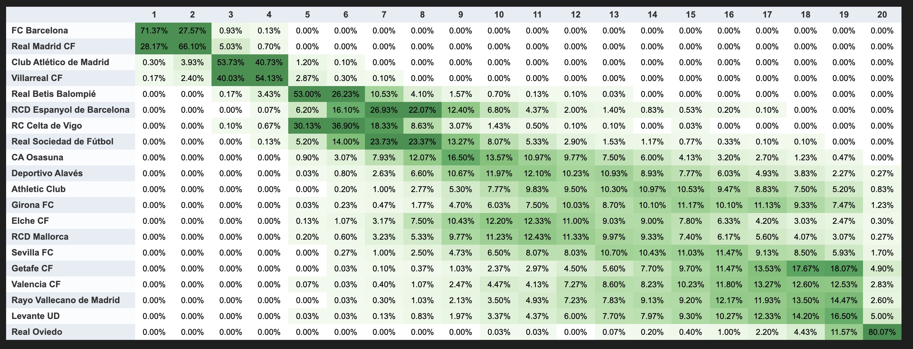

# Football standings prediction

I built this pipeline to estimate where each team will finish in the league. It fits a time-decayed Dixon–Coles goal model and Elo ratings, optionally blends bookmaker odds, then simulates the remaining fixtures.

La Liga is the main use case. The same pipeline supports the Premier League (`PL`), Bundesliga (`BL1`), Serie A (`SA`), and Ligue 1 (`FL1`).



## Run it

Requires Python 3.11 or newer. From the repository root:

```bash
python3 -m venv .venv
source .venv/bin/activate
pip install -e '.[notebook]'
cp .env.example .env
```

Set `FOOTBALL_DATA_API_KEY` in `.env` using a key from [football-data.org](https://www.football-data.org/). `ODDS_API_KEY` is optional. For CLI use alone, install with `pip install -e .` instead.

For the exact core dependency versions used in validation, use Python 3.12, then run `pip install -r requirements-lock.txt` followed by `pip install -e .`. Notebook extras can be installed afterward.

```bash
football-predict --competition PD
```

The default is 10,000 simulations with seed 7. The season is inferred from the current date, using July as the European-season boundary. To select a season or disable odds:

```bash
football-predict --competition PD --season 2026 --n-sim 10000 --no-use-odds
```

The module command also works: `python -m standing_prediction.predict_positions`.

## Read the forecast

Open `out/pd_position_probs.html` for the summary and position-probability heatmap. The latest run also writes:

- `pd_position_probs.csv`: percentage probability of every finishing position.
- `pd_summary.csv`: expected position, expected points, 10th–90th point percentiles, and title/top-four/bottom-three probabilities.
- `pd_metadata.json`: generation time, data cutoff, odds coverage, model settings, seed, and limitations.
- `pd_matches_snapshot.csv`, `pd_standings_snapshot.csv`, and, when available, `pd_odds_snapshot.csv`.

Each run is also archived under `out/snapshots/pd/<season>/<timestamp>/`. Use `--out-dir` to change the output root. The example image above is illustrative; saved metadata identifies when a forecast was generated.

Point intervals describe simulated match results **conditional on fitted team strengths**. They do not include uncertainty in those strengths or future injuries and transfers. `*_mc_se_pp` columns measure Monte Carlo sampling error in percentage points; increasing the simulation count reduces that error, not model error.

Top four and bottom three refer to table positions. They do not determine European qualification or direct relegation for every league.

## Notebooks

```bash
jupyter lab
```

Open `laliga_prediction.ipynb` or `laliga_prediction_upgraded.ipynb` from the repository root and run the cells in order. Both call the same `run_prediction` function as the CLI, display the summary and heatmap, and export the forecast. The original simple notebook now uses the shared pipeline.

The credited Premier League notebook in `notebooks/202601 - 7 - Predicting Premier League Final Positions Using Betting Odds, Probabilistic Modelling & Simulation.ipynb` is an external reference by Victoria Friss de Kereki. It is not a supported entry point for this pipeline.

## Backtest it

```bash
football-backtest --competition PD --seasons 2022 2023 2024 --cutoffs 5 10 20 30
```

This evaluates dated forecasts across completed seasons, using 2,000 simulations per snapshot by default. Cutoffs approximate completed rounds by counting matches chronologically, then including the whole UTC day. They are not provider matchday labels.

Calibration is evaluated on expanding historical seasons: a season can use calibration rows only from earlier evaluated seasons. The first season provides the uncalibrated baseline. Reports under `out/backtests/` include match log loss/Brier scores, final-position ranked probability score, expected points/position errors, and event Brier scores.

Historical tables are reconstructed from scores and modeled ranking rules. They exclude disciplinary deductions, appeals, and deciding playoffs, so they can differ from official tables, particularly in the Premier League and Serie A.

Historical CSV odds have no observation timestamps, so they are excluded from dated forecasts. To evaluate odds, supply a timestamped archive:

```bash
football-backtest --competition PD --seasons 2024 --use-odds --odds-snapshot odds_history.csv
```

See [pipeline details](PIPELINE_DETAILS.md) for the snapshot format, ranking rules, and modeling limits, and [the notebook guide](notebooks/PREDICTION_METHOD.md) for the Python API.

## Validation snapshot

The saved [example forecast](examples/laliga_position_probs.html) includes its [metadata](examples/laliga_metadata.json). Generated files under `out/` are ignored by Git.

A La Liga comparison across 2022/23–2024/25, at cutoff rounds 5, 10, 20, and 30, gave a match-weighted blend log loss of **0.9838 with two prior seasons**, compared with **1.0320 without priors**. Mean final-position RPS was **0.0715 vs 0.0798** (lower is better). Both variants used the same dated fixtures, no odds, seed 7, and 2,000 simulations per snapshot. These horizons overlap within seasons. Calibration did not consistently improve scores and remains optional.

Saved reports: [with priors](examples/backtest_metrics.csv), [without priors](examples/backtest_no_priors_metrics.csv), and [settings](examples/backtest_metadata.json). Both La Liga notebooks and a 10,000-simulation live forecast were executed successfully.

## Next steps

Use the historical reports to decide which changes help before adding model complexity. Useful candidates are xG, lineups/injuries, and calibrated uncertainty in team strengths. Cups and knockout phases need a separate tournament simulator.
