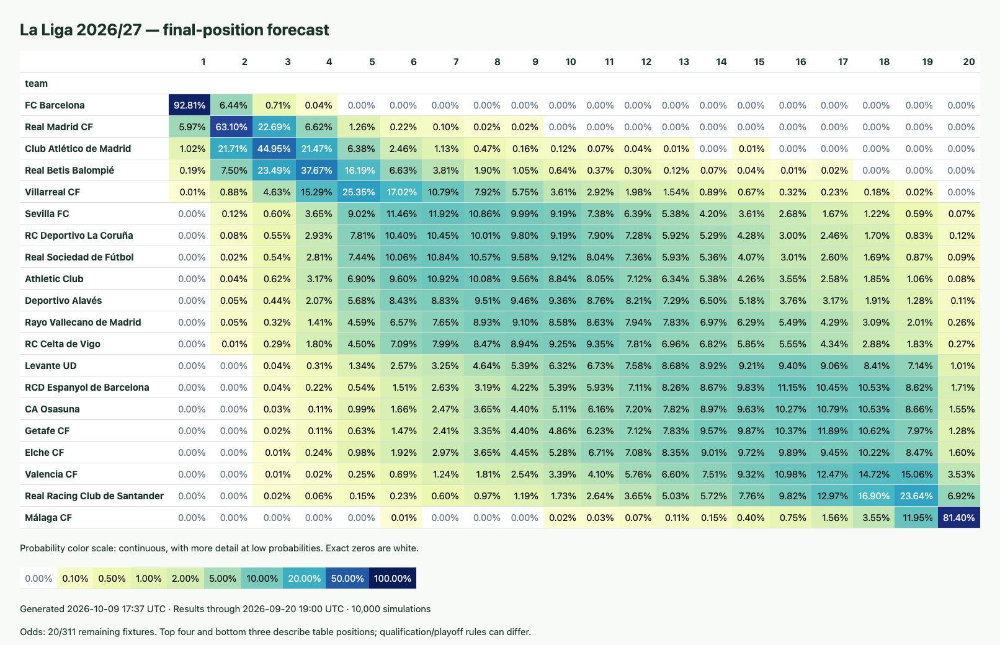

# Football standings prediction



*La Liga 2026/27 snapshot, generated October 9, 2026 at 17:37 UTC. Results through September 20, 2026 at 19:00 UTC; 10,000 simulations, with odds for 20 of 311 remaining fixtures.*

A Python package for estimating every team's final league-position probabilities. The implementation lives in `src/standing_prediction`; the CLI and notebook call the same pipeline.

## Inputs

- **Current season:** standings, completed scores, and the full fixture schedule from [football-data.org](https://www.football-data.org/).
- **Team history:** two prior seasons by default, primarily from [football-data.co.uk](https://www.football-data.co.uk/), with football-data.org as a fallback. Teams without observed history start at neutral strength.
- **Optional odds:** The Odds API or a saved odds CSV. Each observation must be timestamped before kickoff and available by the forecast origin. Undated historical odds are excluded.

## Methods

1. Fit a **Dixon–Coles goal model**, with recent matches weighted more heavily and a correction for low-scoring results.
2. Fit **Elo ratings**, accounting for home advantage and regressing ratings toward average strength between seasons.
3. Blend available model/market probabilities in **log space**, with configurable weights. Optional calibration learns from earlier seasons.
4. Simulate remaining **scorelines**, update points and goals, and rank teams using league sporting rules. La Liga uses head-to-head criteria and reapplies rules to remaining tied subsets.

Head-to-head records currently serve table ranking rather than separate predictive features. xG and additional predictive head-to-head features are future work.

## Outputs

`out/pd_position_probs.html` shows the colored chart first, sorted by each team's most likely finishing position, with average position breaking ties. Two-decimal percentages and a continuous nonlinear scale make small probabilities easier to distinguish. CSVs contain position probabilities and a summary of expected points/position, point percentiles, and title/top-four/bottom-three probabilities. JSON records the cutoff, odds coverage, model settings, and seed.

Input snapshots and each forecast are archived under `out/snapshots/pd/<season>/<timestamp>/`. Point intervals are conditional on fitted team strengths; `*_mc_se_pp` measures simulation sampling error in percentage points, not model error.

## Customize

Use keyword arguments with `run_prediction`, or the corresponding CLI flags (`prior_seasons` → `--prior-seasons`).

| Argument | Default | Controls |
| --- | --- | --- |
| `competition` | `"PD"` | `PD`, `PL`, `BL1`, `SA`, or `FL1` |
| `season` | `None` | Season start year; inferred using a July boundary |
| `n_sim`, `seed` | `10000`, `7` | Simulation count and reproducibility |
| `prior_seasons`, `xi` | `2`, `0.003` | History length and daily time decay |
| `weights` | Main `0.35`, odds `0.55`, Elo `0.10` | Log-space blend; renormalized across available components |
| `use_odds`, `calibrate` | `True`, `False` | Optional market data and historical calibration |
| `max_goals`, `lambda_reg` | `10`, `0.1` | Score-grid limit and model regularization |
| `out_dir` | `"out"` | Output directory |

```python
from dotenv import load_dotenv
from standing_prediction.predict_positions import run_prediction

load_dotenv()
forecast = run_prediction(competition="PD", season=None, n_sim=10000, use_odds=False)
forecast.probabilities
forecast.summary
```

## Run

Requires Python 3.11+. From the repository root:

```bash
python3 -m venv .venv
source .venv/bin/activate
pip install -e .
cp .env.example .env
# Set FOOTBALL_DATA_API_KEY in .env; ODDS_API_KEY is optional.
football-predict --competition PD
```

For the notebook: `pip install -e '.[notebook]'`, then `jupyter lab notebooks/laliga_prediction.ipynb`.

For historical evaluation: `football-backtest --competition PD --seasons 2022 2023 2024 --cutoffs 5 10 20 30`. Cutoffs count matches chronologically to approximate rounds; calibration uses only earlier evaluated seasons. Use `--help` for all options.

## Limits

Point intervals exclude uncertainty in fitted strengths and future squad changes. Calibration is optional and has not consistently improved held-out scores. Fair-play criteria and deciding playoffs, including Serie A exceptions, are not simulated. Historical tables exclude disciplinary deductions and appeals; completed-season prediction exports use official positions. Top-four/bottom-three probabilities describe positions, not automatic qualification or direct relegation. In-progress fixtures are simulated from kickoff with a warning.

See [PLAN.md](PLAN.md) for the next priorities.
